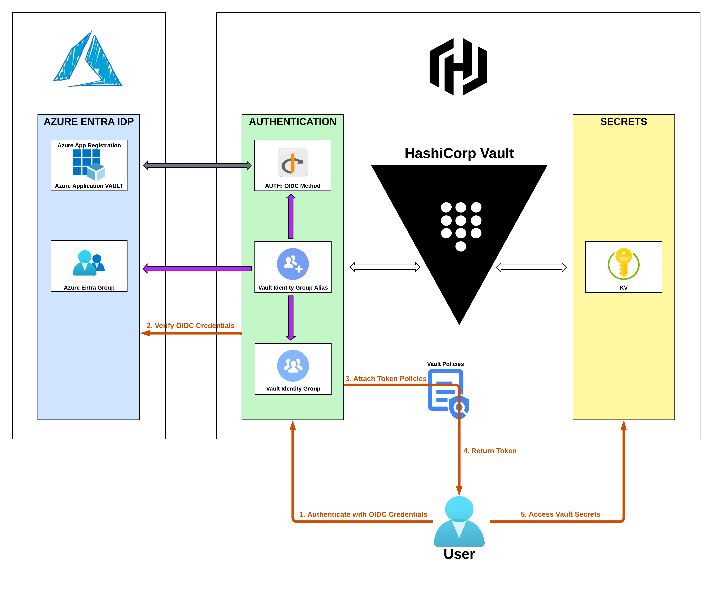

# HashiCorp Vault Authentication - OIDC Provider for Azure AD / Entra

## REQUIREMENTS
- Azure
  - [`az login`](https://learn.microsoft.com/en-us/cli/azure/authenticate-azure-cli-interactively)
- [HashiCorp Vault](https://www.hashicorp.com/products/vault) & [Vault CLI](https://developer.hashicorp.com/vault/tutorials/getting-started/getting-started-install)
- [HashiCorp Terraform](https://developer.hashicorp.com/terraform/install)

## OVERVIEW

Based on the tutorial for [HashiCorp Vault OIDC Provider Authentication Method for Azure AD (Entra)](https://developer.hashicorp.com/vault/docs/auth/jwt/oidc-providers/azuread#optional-azure-specific-configuration), this is the High Level Overview workflow:

[](https://developer.hashicorp.com/vault/docs/auth/jwt/oidc-providers/azuread)

#### Resources

This Repo codifies some highlighted Azure and HashiCorp Vault `resources` (not comprehensive):

- Provider: [**hashicorp/azuread**](https://registry.terraform.io/providers/hashicorp/azuread/latest)
  - `azuread_application`
  - `azuread_group`
- Provider: [**hashicorp/vault**](https://registry.terraform.io/providers/hashicorp/vault/latest)
  - `vault_jwt_auth_backend`
  - `vault_jwt_auth_backend_role`
  - `vault_policy`
  - `vault_identity_group`
  - `vault_identity_group_alias`
  - `vault_kv_secret_v2`
    - `secret/app1` (`vault kv metadata get -mount=secret app1`)
    - `secret/app2` (`vault kv metadata get -mount=secret app2`)

[]()

#### Groups: Azure AD / Entra <=> Vault Mapping

Place your user into the appropriate Azure AD / Entra Group(s) to apply the correct Group Policies.

| AZURE GROUP | VAULT GROUP | VAULT SECRETS PATH | VAULT POLICY |
|-|-|-|-|
| {{user}}-demo-oidc-group-example | vault_identity_group.oidc_provider_azure_group_example | | [](){:target="_blank"} |
| {{user-}}demo-oidc-group-app1 | vault_identity_group.oidc_provider_azure_group_app1 | **secrets/app1** | [app1_owner_policy.tpl](./terraform/templates/app1_owner_policy.tpl){:target="_blank"} |
| {{user-}}demo-oidc-group-app2 | vault_identity_group.oidc_provider_azure_group_app2 | **secrets/app2** | [app2_owner_policy.tpl](./terraform//templates/app2_owner_policy.tpl){:target="_blank"} |
| {{user-}}demo-oidc-group-admin | vault_identity_group.oidc_provider_azure_group_admin | **secrets/*** | [vault_admin_owner_policy.tpl](./terraform/templates/vault_admin_policy.tpl){:target="_blank"} |
| {{user-}}demo-oidc-group-super-admin | vault_identity_group.oidc_provider_azure_group_super_admin | **secrets/***| [vault_super_admin_policy.tpl](./terraform/templates/vault_super_admin_policy.tpl){:target="_blank"} |

---

## TLDR

- Set Azure and HashiCorp Vault logins and addresses - can be set via Environment Variables and/or `az` CLI
- Go to ./terraform directory, execute `terraform init` and `terraform apply`
- Place your user into the appropriate Azure AD / Entra Group(s) to apply the correct Group Policies.
- Log in to Vault UI via `OIDC` Authentication and set the `More Options` => `Mount Path` to your TF Variable value for `var.vault_auth_mount_path` (default: `oidc-azure`)
- Verify ability to read secrets at `secret/app1` or `secret/app2` KVv2 Secrets paths.
- Log out
- Repeat with other Azure AD / Entra Group(s)
- Log back in
---
## FILES
Repo Layout

```
.
├── LICENSE
├── Makefile
├── README.md
├── assets
│   ├── convergence-scenarios-webapp-webapi.svg
│   ├── convergence-scenarios-webapp.svg
│   └── vault.auth-oidc-azure.01.png
└── terraform
    ├── 00.variables.tf
    ├── 00.versions.tf
    ├── 01-01.azuread_application.tf
    ├── 01-02.azuread.groups.tf
    ├── 02-01.vault.oidc_provider.tf
    ├── 02-02.vault.policies.tf
    ├── 02-03.vault.aliases_groups.tf
    ├── 02-04.vault.secrets.tf
    ├── 99.outputs.tf
    ├── templates
    │   ├── app1_owner_policy.tpl
    │   ├── app1_reader_policy.tpl
    │   ├── app2_owner_policy.tpl
    │   ├── app2_reader_policy.tpl
    │   ├── vault_admin_policy.tpl
    │   └── vault_super_admin_policy.tpl
    ├── terraform.auto.tfvars
    ├── terraform.tfstate
    └──  terraform.tfstate.backup
```

---

## TERRAFORM
#### Requirements

| Name | Version |
|------|---------|
| <a name="requirement_terraform"></a> [terraform](#requirement\_terraform) | >= 0.13 |
| <a name="requirement_azuread"></a> [azuread](#requirement\_azuread) | >= 2.47.0 |
| <a name="requirement_azurerm"></a> [azurerm](#requirement\_azurerm) | >= 3.97.1 |
| <a name="requirement_vault"></a> [vault](#requirement\_vault) | >= 4.1.0 |

#### Providers

| Name | Version |
|------|---------|
| <a name="provider_azuread"></a> [azuread](#provider\_azuread) | 2.47.0 |
| <a name="provider_random"></a> [random](#provider\_random) | 3.6.0 |
| <a name="provider_vault"></a> [vault](#provider\_vault) | 4.1.0 |

#### Modules

No modules.

#### Resources

| Name | Type |
|------|------|
| [azuread_application.demo-oidc-example](https://registry.terraform.io/providers/hashicorp/azuread/latest/docs/resources/application) | resource |
| [azuread_application_password.demo-oidc-password-example](https://registry.terraform.io/providers/hashicorp/azuread/latest/docs/resources/application_password) | resource |
| [azuread_group.demo-oidc-group-admin](https://registry.terraform.io/providers/hashicorp/azuread/latest/docs/resources/group) | resource |
| [azuread_group.demo-oidc-group-app1](https://registry.terraform.io/providers/hashicorp/azuread/latest/docs/resources/group) | resource |
| [azuread_group.demo-oidc-group-app2](https://registry.terraform.io/providers/hashicorp/azuread/latest/docs/resources/group) | resource |
| [azuread_group.demo-oidc-group-example](https://registry.terraform.io/providers/hashicorp/azuread/latest/docs/resources/group) | resource |
| [azuread_group.demo-oidc-group-super-admin](https://registry.terraform.io/providers/hashicorp/azuread/latest/docs/resources/group) | resource |
| [azuread_service_principal.demo-oidc-example](https://registry.terraform.io/providers/hashicorp/azuread/latest/docs/resources/service_principal) | resource |
| [random_pet.example](https://registry.terraform.io/providers/hashicorp/random/latest/docs/resources/pet) | resource |
| [vault_identity_group.oidc_provider_azure_group_admin](https://registry.terraform.io/providers/hashicorp/vault/latest/docs/resources/identity_group) | resource |
| [vault_identity_group.oidc_provider_azure_group_app1](https://registry.terraform.io/providers/hashicorp/vault/latest/docs/resources/identity_group) | resource |
| [vault_identity_group.oidc_provider_azure_group_app2](https://registry.terraform.io/providers/hashicorp/vault/latest/docs/resources/identity_group) | resource |
| [vault_identity_group.oidc_provider_azure_group_example](https://registry.terraform.io/providers/hashicorp/vault/latest/docs/resources/identity_group) | resource |
| [vault_identity_group.oidc_provider_azure_group_super_admin](https://registry.terraform.io/providers/hashicorp/vault/latest/docs/resources/identity_group) | resource |
| [vault_identity_group_alias.oidc_provider_azure_group_admin_alias](https://registry.terraform.io/providers/hashicorp/vault/latest/docs/resources/identity_group_alias) | resource |
| [vault_identity_group_alias.oidc_provider_azure_group_app1_alias](https://registry.terraform.io/providers/hashicorp/vault/latest/docs/resources/identity_group_alias) | resource |
| [vault_identity_group_alias.oidc_provider_azure_group_app2_alias](https://registry.terraform.io/providers/hashicorp/vault/latest/docs/resources/identity_group_alias) | resource |
| [vault_identity_group_alias.oidc_provider_azure_group_example_alias](https://registry.terraform.io/providers/hashicorp/vault/latest/docs/resources/identity_group_alias) | resource |
| [vault_identity_group_alias.oidc_provider_azure_group_super_admin_alias](https://registry.terraform.io/providers/hashicorp/vault/latest/docs/resources/identity_group_alias) | resource |
| [vault_jwt_auth_backend.oidc_provider_azure](https://registry.terraform.io/providers/hashicorp/vault/latest/docs/resources/jwt_auth_backend) | resource |
| [vault_jwt_auth_backend_role.oidc_provider_azure_role](https://registry.terraform.io/providers/hashicorp/vault/latest/docs/resources/jwt_auth_backend_role) | resource |
| [vault_kv_secret_v2.app1_secret](https://registry.terraform.io/providers/hashicorp/vault/latest/docs/resources/kv_secret_v2) | resource |
| [vault_kv_secret_v2.app2_secret](https://registry.terraform.io/providers/hashicorp/vault/latest/docs/resources/kv_secret_v2) | resource |
| [vault_mount.kvv2](https://registry.terraform.io/providers/hashicorp/vault/latest/docs/resources/mount) | resource |
| [vault_policy.app1_owner](https://registry.terraform.io/providers/hashicorp/vault/latest/docs/resources/policy) | resource |
| [vault_policy.app1_reader](https://registry.terraform.io/providers/hashicorp/vault/latest/docs/resources/policy) | resource |
| [vault_policy.app2_owner](https://registry.terraform.io/providers/hashicorp/vault/latest/docs/resources/policy) | resource |
| [vault_policy.app2_reader](https://registry.terraform.io/providers/hashicorp/vault/latest/docs/resources/policy) | resource |
| [vault_policy.vault_admin](https://registry.terraform.io/providers/hashicorp/vault/latest/docs/resources/policy) | resource |
| [vault_policy.vault_super_admin](https://registry.terraform.io/providers/hashicorp/vault/latest/docs/resources/policy) | resource |
| [azuread_application_published_app_ids.well_known](https://registry.terraform.io/providers/hashicorp/azuread/latest/docs/data-sources/application_published_app_ids) | data source |
| [azuread_client_config.current](https://registry.terraform.io/providers/hashicorp/azuread/latest/docs/data-sources/client_config) | data source |
| [azuread_service_principal.msgraph](https://registry.terraform.io/providers/hashicorp/azuread/latest/docs/data-sources/service_principal) | data source |

#### Inputs

| Name | Description | Type | Default | Required |
|------|-------------|------|---------|:--------:|
| <a name="input_azure_tenant_id"></a> [azure\_tenant\_id](#input\_azure\_tenant\_id) | Azure Tenant ID | `string` | `""` | yes |
| <a name="input_user"></a> [user](#input\_user) | Demo User | `string` | `"user"` | no |
| <a name="input_vault_auth_mount_path"></a> [vault\_auth\_mount\_path](#input\_vault\_auth\_mount\_path) | Vault Authentication Mount Path | `string` | `"oidc-azure"` | yes |
| <a name="input_vault_cli_port"></a> [vault\_cli\_port](#input\_vault\_cli\_port) | Vault CLI Port | `string` | `"8250"` | no |
| <a name="input_vault_port"></a> [vault\_port](#input\_vault\_port) | Vault Port | `string` | `"8200"` | no |
| <a name="input_vault_root_token"></a> [vault\_root\_token](#input\_vault\_root\_token) | Vault Root Token | `string` | `""` | yes |
| <a name="input_vault_url"></a> [vault\_url](#input\_vault\_url) | Vault URL | `string` | `"http://localhost:8200"` | yes |

#### Outputs

| Name | Description |
|------|-------------|
| <a name="output_azuread_application_client_id"></a> [azuread\_application\_client\_id](#output\_azuread\_application\_client\_id) | `oidc_client_id` |
| <a name="output_azuread_application_id"></a> [azuread\_application\_id](#output\_azuread\_application\_id) | `oidc_client_id` |
| <a name="output_azuread_application_object_id"></a> [azuread\_application\_object\_id](#output\_azuread\_application\_object\_id) | n/a |
| <a name="output_azuread_application_oidc_metadata_document"></a> [azuread\_application\_oidc\_metadata\_document](#output\_azuread\_application\_oidc\_metadata\_document) | `oidc_discovery_url` |
| <a name="output_azuread_application_password"></a> [azuread\_application\_password](#output\_azuread\_application\_password) | `oidc_client_secret` |
| <a name="output_azuread_application_password_id"></a> [azuread\_application\_password\_id](#output\_azuread\_application\_password\_id) | n/a |
| <a name="output_azuread_application_password_key_id"></a> [azuread\_application\_password\_key\_id](#output\_azuread\_application\_password\_key\_id) | n/a |
| <a name="output_azuread_group_id"></a> [azuread\_group\_id](#output\_azuread\_group\_id) | n/a |
| <a name="output_azuread_group_object_id"></a> [azuread\_group\_object\_id](#output\_azuread\_group\_object\_id) | n/a |
| <a name="output_azuread_group_owner"></a> [azuread\_group\_owner](#output\_azuread\_group\_owner) | n/a |
| <a name="output_oidc_client_id"></a> [oidc\_client\_id](#output\_oidc\_client\_id) | `oidc_client_id` |
| <a name="output_oidc_client_secret"></a> [oidc\_client\_secret](#output\_oidc\_client\_secret) | `oidc_client_secret` |
| <a name="output_oidc_discovery_url"></a> [oidc\_discovery\_url](#output\_oidc\_discovery\_url) | `oidc_discovery_url` |

---

## APPENDIX:
#### References:
###### Terraform Providers:
- https://registry.terraform.io/providers/hashicorp/azuread
- https://registry.terraform.io/providers/hashicorp/azurerm
- https://registry.terraform.io/providers/hashicorp/vault
- 
###### Vault Auth OIDC
- https://developer.hashicorp.com/vault/docs/auth/jwt/oidc-providers/azuread
- https://developer.hashicorp.com/vault/docs/auth/jwt#redirect-uris
- https://developer.hashicorp.com/vault/tutorials/auth-methods/oidc-auth-azure
###### Azure
- https://learn.microsoft.com/en-us/cli/azure/authenticate-azure-cli-interactively
- https://learn.microsoft.com/en-us/entra/identity-platform/v2-oauth2-auth-code-flow
- https://learn.microsoft.com/en-us/entra/identity-platform/v2-protocols-oidc
- 
- https://learn.microsoft.com/en-us/troubleshoot/azure/active-directory/verify-first-party-apps-sign-in#application-ids-of-commonly-used-microsoft-applications
- https://learn.microsoft.com/en-us/graph/migrate-azure-ad-graph-permissions-differences#userread
###### Miscellaneous
- https://solideogloria.tech/terraform/grant-admin-consent-for-an-azure-ad-application-with-terraform/
- https://www.youtube.com/watch?v=6Kl7rR0husk
- https://itinsights.org/HashiCorp-Vault-Authenticate-and-authorize-AzureAD-Users/
- https://registry.terraform.io/modules/devops-rob/app-vault/azuread/latest
- https://www.hashicorp.com/blog/integrating-azure-ad-identity-hashicorp-vault-part-1-application-auth-oidc
- https://www.hashicorp.com/blog/integrating-azure-ad-identity-with-hashicorp-vault-part-2-vault-oidc-auth-method
- https://www.hashicorp.com/blog/integrating-azure-ad-identity-vault-part-3-azure-managed-identity-via-azure-auth-method
######
